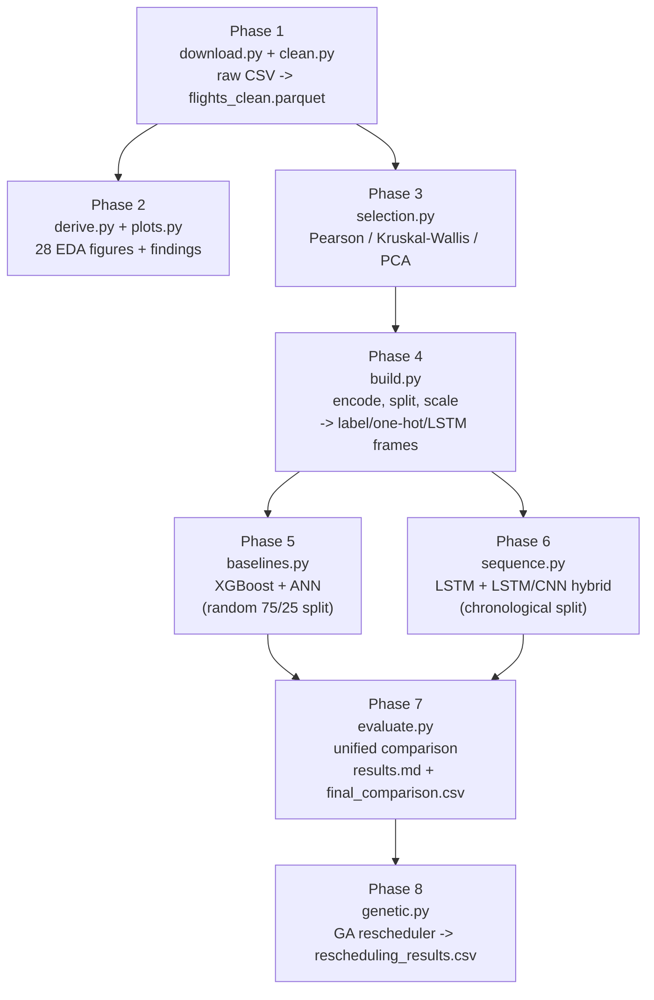

# Flight Delay Prediction

## Problem statement

US domestic flights are frequently delayed, and delays are attributed to one
of five causes tracked by the Bureau of Transportation Statistics (BTS):
carrier, weather, National Airspace System (NAS), security, and late
aircraft. This project builds a reproducible, production-style pipeline to
predict:

- the five delay-component targets — `DELAY_DUE_CARRIER`, `DELAY_DUE_WEATHER`,
  `DELAY_DUE_NAS`, `DELAY_DUE_SECURITY`, `DELAY_DUE_LATE_AIRCRAFT`
- overall arrival delay (`ARR_DELAY`)

for US domestic flights, using historical BTS data — and to honestly report
how well that works, which (see Findings) turns out to be "a little, not a
lot."

## Dataset

[`patrickzel/flight-delay-and-cancellation-dataset-2019-2023`](https://www.kaggle.com/datasets/patrickzel/flight-delay-and-cancellation-dataset-2019-2023)
on Kaggle — `flights_sample_3m.csv`, ~3M rows of US DOT BTS flight records.
Downloaded programmatically via `kagglehub`.

The dataset description advertises August 2019 through August 2023. The
actual `FL_DATE` range in the downloaded file is **2019-01-01 to
2023-08-31** — the full 2019 calendar year is present, not just its last
five months. Every date-range statement elsewhere in this README uses the
real range.

## Pipeline



## Repo layout

```
configs/config.yaml       All configuration: paths, seed, targets, features, hyperparameters
data/
  raw/                     Downloaded source CSV (gitignored)
  interim/                 Intermediate artifacts (gitignored)
  processed/               Modeling-ready Parquet (gitignored)
models/                    Trained model artifacts + preprocessors (gitignored)
reports/
  figures/                 Generated plots (gitignored)
  metrics/                 Metrics JSON/CSV (gitignored)
  cleaning_summary.md      Row counts and stats from the cleaning run
  eda_findings.md          One finding per EDA figure, with numbers
  feature_selection.md     Pearson / Kruskal-Wallis / PCA statistics and decisions
  results.md               Final model comparison (this phase)
reference/                 Original source notebooks (FINAL.ipynb, EDA.ipynb)
src/
  config.py                Loads configs/config.yaml into a frozen dataclass
  data/
    download.py             Kaggle dataset download
    clean.py                Cleaning pipeline
  features/
    derive.py                EDA derived columns (season, time-of-day, ...)
    selection.py              Feature-selection statistics
    build.py                  Encoding, splits, scaling, sequence data
  models/
    baselines.py              XGBoost + ANN (random split)
    sequence.py                LSTM + LSTM/CNN hybrid (chronological split)
    evaluate.py                Unified comparison across both splits
  scheduling/
    genetic.py                  GA rescheduler (Phase 8)
  eda/
    plots.py                   28 EDA figures
  utils/
    seed.py                  Deterministic seeding
    io.py                    Parquet save/load + cache helper
    plotting.py              Shared matplotlib styling
tests/                     Pytest unit tests
```

## Setup

```bash
make install
make data    # downloads the raw CSV and runs the cleaning pipeline
make test
```

## How to run each phase

```bash
python -m src.data.download                       # Phase 1: fetch the raw CSV
python -m src.data.clean [--force]                 # Phase 1: clean -> flights_clean.parquet
python -m src.eda.plots                            # Phase 2: 28 figures + eda_findings.md
python -m src.features.selection                   # Phase 3: feature_selection.md
python -m src.features.build [--force] [--no-validate]  # Phase 4: encode/split/scale
python -m src.models.baselines --model {xgb,ann,all}    # Phase 5: baseline models
python -m src.models.sequence --model {lstm,hybrid,all} # Phase 6: sequence models
python -m src.models.evaluate                       # Phase 7: unified comparison
python -m src.scheduling.genetic                     # Phase 8: GA rescheduler
```

Every module is also importable directly (`from src.data.clean import clean`).

## Results

All four models evaluated on the **same** chronological test set (XGBoost and
the ANN retrained on `X_train_lstm`/`Y_train_lstm` with identical
hyperparameters to Phase 5, so this table is a fair comparison — the
mean-predictor floor row is what every model is being compared against):

| model | test MSE | test MAE | % improvement over floor (MSE) |
|---|---|---|---|
| mean-predictor floor | 409.24 | 11.37 | — |
| **XGBoost** | **347.87** | **9.56** | **15.0%** |
| LSTM | 355.74 | 9.82 | 13.1% |
| Hybrid | 357.50 | 9.77 | 12.6% |
| ANN | 364.60 | 9.69 | 10.9% |

XGBoost wins on this identical-data comparison. Full per-component
breakdowns, the each-model-on-its-own-split table, and the
prediction-variance check are in [`reports/results.md`](reports/results.md);
the source data is in
[`reports/metrics/final_comparison.csv`](reports/metrics/final_comparison.csv).


## Findings

- **Only ~18% of rows carry a delay-cause breakdown.** BTS only publishes
  the five `DELAY_DUE_*` columns for arrivals 15+ minutes late (533,863 of
  2,913,804 non-cancelled/diverted rows, 18.3%; 17.8% of all 3,000,000 raw
  rows). Every model in this project is therefore modeling *delayed
  flights only* — not "will this flight be delayed," but "given it already
  is, how is that delay attributed and how long is it."
- **Every scheduling feature correlates with `ARR_DELAY` below r=0.08**
  (Phase 3; `CRS_DEP_TIME` highest at r=0.0704). The models beat a
  mean-predictor floor by roughly 11-17% (MSE), which is real — every model
  learned *something* — but modest, and no model here is close to a strong
  fit. Predicted values also have visibly lower variance than the actual
  delays for every model and every component (confirmed directly in
  `results.md`): with this little signal, MSE-minimizing models converge
  toward predicting something close to the mean rather than reproducing the
  true spread.
- **The sequence models do not beat XGBoost — this is the project's main
  finding.** On an identical chronological test set, XGBoost's MSE (347.87)
  beats both LSTM (355.74) and the hybrid (357.50), contradicting the
  source report's claim of time-series superiority. The architectural
  reason: both sequence models are built with `Input(shape=(11, 1))`, which
  feeds the **11 feature columns** of a single flight as 11 "timesteps" of
  a length-1 channel. Each training sample is one flight; there is no
  sequence of flights anywhere in the input. The LSTM's recurrence steps
  across *feature slots* (year, then month, then day, then airline, ...),
  not across *time*, so there is no temporal dependency in the data for it
  to capture. A model built this way cannot outperform a non-sequential
  model on structural grounds, and it doesn't.
- **The source report's identical LSTM and hybrid MSE (367.868) traces to
  inconsistent checkpoint paths.** One `ModelCheckpoint` wrote to
  `"models/lstm_model.keras"`, the other to `"../models/hybrid_model.keras"`
  — cwd-dependent relative paths. With both checkpoints pointed at
  config-driven paths and each session's own file confirmed to exist before
  reload, the two models produce different metrics (355.74 vs. 357.50).
- **The source's ANN MSE of 1118.49 vs. our 368.53, despite both reporting
  MAE ≈ 10.02**, indicates a few extreme predictions from an unseeded
  initialization, not a materially different model. MAE is robust to a
  handful of large misses; MSE is not. The source notebook never seeds
  NumPy, Python's `random`, or TensorFlow (only `XGBRegressor`'s own
  `random_state=42`), so its ANN runs are not reproducible. This project
  calls `set_all_seeds(42)` first in every entry point.
- **The source's holiday finding was a label swap**: it reported ~30x more
  delays on holidays, but the two bar labels (`Holiday`/`Non-holiday`) were
  swapped relative to the underlying `True`/`False` groups. Correctly
  labeled, non-holiday days have the higher per-day delay rate (251.5/day
  vs. 236.9/day for departures) simply because there are far more
  non-holiday days in the range (1,648 vs. 56).
- **The source's taxi-in-by-airline result came from index-misaligned
  assignment across differently-filtered frames.** In `EDA.ipynb`, the
  taxi-flag analysis slices a subset (`pot = data[[...]]`) from a `data`
  variable that gets reassigned and re-filtered many times across the
  notebook's ~150 cells, then mutates that subset's columns in place with
  `np.where(...)`. If the slice and the mutation don't share the same row
  index at the time each cell runs, the `High`/`Low` labels no longer line
  up with the `AIRLINE` column they're grouped by. Our from-scratch Phase 2
  computation found Southwest as the airline with the most high-taxi-in
  flights, not American as the source reported — the taxi-out result
  (SkyWest) and the destination/origin results (ORD on both) matched.

## Limitations

- **`TAXI_IN`/`TAXI_OUT` are only known after the aircraft has actually
  taxied** — they aren't available at the time a schedule is published.
  Every model here is *explanatory* (why was this flight's delay what it
  was) rather than *predictive at scheduling time* (how delayed will an
  upcoming flight be, using only information available when it's
  scheduled).
- **IQR outlier pruning removed 8.25% of rows** (44,035 of 533,863) —
  including genuine extreme delays, not just data errors. The models are
  evaluated on a population that already excludes the longest, presumably
  most-consequential delays.
- **The chronological test period is entirely post-COVID-recovery** (2022-10-16
  to 2023-08-31 — every row) **while training spans the 2020-2021 collapse**
  (41,037 rows in 2020, 95,367 in 2021, out of 367,371 training rows). The
  LSTM/hybrid models were trained partly on a demand regime that no longer
  existed by the time they're tested.
- **Generalization to unseen airports and routes is untested.** `ORIGIN`
  and `DEST` are label-encoded from the training vocabulary; nothing in
  this pipeline evaluates how any model behaves on an airport it never saw
  during training.

## Rescheduling (Phase 8)

`src/scheduling/genetic.py` implements the genetic-algorithm rescheduler:
per-day search over `CRS_DEP_TIME` for 2023-08-31's 333 delayed flights
(`data/processed/flights_clean.parquet`), using the source notebook's exact
constants and operators — `POPULATION_SIZE=50`, `NUM_GENERATIONS=100`,
`MUTATION_RATE=0.1`, `TOURNAMENT_SIZE=5`, tournament selection, single-point
crossover, mutation perturbation ±63 (init ±30), both clipped to `[0, 2359]`.

Two things were **not** ported as-is. First, the source notebook's fitness
function reassigns `data_day['CRS_DEP_TIME']` to the candidate schedule but
then sums the *unmodified* `DEP_DELAY` column — it never recomputes delay
from the candidate, which its own logged run confirms: every one of its 100
generations reports an identical "Best Score (Total Delay): 18974.0." This
build instead scores each candidate with XGBoost retrained on the
chronological split (Phase 7), predicting the five `DELAY_DUE_*`
components under that schedule and summing them — an ARR_DELAY-proxy
substituted for DEP_DELAY, since no model in this project predicts
DEP_DELAY. Second, that same in-place mutation corrupts the source
notebook's own output table: its "original" `CRS_DEP_TIME` column shows
1993 and 1078 for two flights whose real scheduled times are 2050 and
1030 — leaked, un-normalized chromosome state, not a genuine
minutes-vs-HHMM representation choice. This build never mutates the source
frame, so its `CRS_DEP_TIME` column is the untouched original.

**Result**: optimizing the day's schedule reduces model-predicted total
delay from **15,765.90 to 15,227.05 minutes — a 3.42% improvement.** That's
real (the convergence plot in `reports/figures/ga_convergence.png` shows
steady, non-trivial improvement across 100 generations, not noise) but
modest, consistent with Phase 3's finding that every feature correlates
with delay below r=0.08: there's little schedule-sensitive signal in the
model for the GA to exploit, so a large win was never on the table. Full
per-flight output is in
[`reports/rescheduling_results.csv`](reports/rescheduling_results.csv).

### Is the improvement schedulable, or model extrapolation?

A GA that scores candidates with a trained model can "improve" its score by
finding inputs the model handles well, not inputs that are actually good
schedules — particularly if it pushes flights into hours the model saw
little of during training. Checked directly below: the hourly distribution
of `CRS_DEP_TIME` across the 367,371-flight chronological training set
(recovered from the fitted `StandardScaler`'s inverse transform, not a
rescaled proxy), next to the original and optimized hourly distributions
for 2023-08-31's 333 flights.

| hour | train n | train % | original day n | optimized day n |
|---|---|---|---|---|
| 0 | 684 | 0.19% | 0 | 0 |
| 1 | 276 | 0.08% | 1 | 1 |
| 2 | 120 | 0.03% | 1 | 0 |
| 3 | 94 | 0.03% | 0 | 1 |
| 4 | 52 | 0.01% | 0 | 0 |
| 5 | 3,110 | 0.85% | 1 | 4 |
| 6 | 12,584 | 3.43% | 6 | 6 |
| 7 | 18,025 | 4.91% | 13 | 6 |
| 8 | 15,386 | 4.19% | 11 | 19 |
| 9 | 16,908 | 4.60% | 14 | 18 |
| 10 | 19,644 | 5.35% | 21 | 14 |
| 11 | 19,900 | 5.42% | 22 | 16 |
| 12 | 21,454 | 5.84% | 15 | 21 |
| 13 | 22,181 | 6.04% | 14 | 19 |
| 14 | 24,231 | 6.60% | 11 | 9 |
| 15 | 26,346 | 7.17% | 16 | 16 |
| 16 | 26,755 | 7.28% | 29 | 30 |
| 17 | 29,668 | 8.08% | 24 | 19 |
| 18 | 29,966 | 8.16% | 33 | 32 |
| 19 | 26,727 | 7.28% | 29 | 24 |
| 20 | 23,436 | 6.38% | 34 | 25 |
| 21 | 15,874 | 4.32% | 20 | 24 |
| 22 | 11,066 | 3.01% | 16 | 20 |
| 23 | 2,884 | 0.79% | 2 | 9 |

Hours 0-5 and 23 are all under 1% of training rows each — genuine
overnight/red-eye scarcity, not a data artifact. The optimized schedule
puts **15 of 333 flights (4.5%)** into these sparse hours, versus 5 (1.5%)
in the original — a 3x increase, concentrated almost entirely at hour 23
(2 -> 9 flights).

Decomposing the 538.85-minute total improvement by whether a flight was
newly pushed into a sparse hour (starting outside one, landing in one)
settles which conclusion holds: **12 of the 333 flights** were newly moved
into a sparse hour, and they account for **88.12 minutes of the
improvement — 16.4% of the total — averaging 7.34 min/flight**, roughly
5x the 1.40 min/flight average improvement among the other 321 flights
(450.73 minutes, 83.6% of the total). The sparse-hour flights are a small
minority of the schedule but contribute a disproportionate share of the
apparent gain, and their per-flight "improvement" is exactly the kind of
outsized, hard-to-verify swing you'd expect from a model extrapolating
into a region with little training support, not a well-calibrated
prediction.

**Conclusion: mostly a real, schedulable finding, with a real but minority
extrapolation problem.** 83.6% of the improvement comes from flights that
stayed within well-represented departure hours, where the model has
enough training data to be trusted directionally — that part of the
result is defensible. The remaining 16.4%, concentrated in just 12 flights
pushed toward the training set's thinnest hours (particularly the
overnight slot), should not be read as a genuine scheduling insight; it is
better explained as the GA exploiting the model's uncertainty in
under-sampled territory. A production version of this optimizer would need
to constrain candidate departure times to well-represented hours (or
penalize moves into sparse ones) to avoid rewarding exactly this failure
mode.

## Future work

- Feature engineering beyond what Phase 3/4 selected — weather data, airport
  congestion/capacity, and rolling airline/route delay history are all
  absent from the current feature set and are more likely to carry signal
  than the scheduling fields alone (r<0.08 across the board).
- Re-evaluate the sequence architectures with an actual sequence as input —
  e.g. a window of a route's or airport's recent flights — now that this
  build has established that feeding 11 features as 11 timesteps gives an
  LSTM nothing temporal to learn from.
- The rescheduler's own internal arithmetic (raw-integer perturbation of
  HHMM-encoded times) doesn't correspond exactly to real minute-of-day
  shifts whenever it crosses a hundreds-digit boundary (e.g. 950 + 63 = 1013,
  which decodes as 10:13, not the correct 10:53) — ported unchanged from
  the source notebook per this phase's "do not redesign" instruction, but
  worth fixing to minutes-past-midnight arithmetic in any future revision.

## Pipeline status

- [x] Phase 1 — Scaffold, data acquisition, cleaning
- [x] Phase 2 — EDA and figures
- [x] Phase 3 — Feature-selection statistics (Pearson, Kruskal–Wallis, PCA check)
- [x] Phase 4 — Feature engineering, encoding, splits, scaling
- [x] Phase 5 — Baseline models (XGBoost, ANN)
- [x] Phase 6 — Sequence models (LSTM, LSTM+CNN hybrid)
- [x] Phase 7 — Evaluation, comparison table, README
- [x] Phase 8 — Rescheduling optimizer
